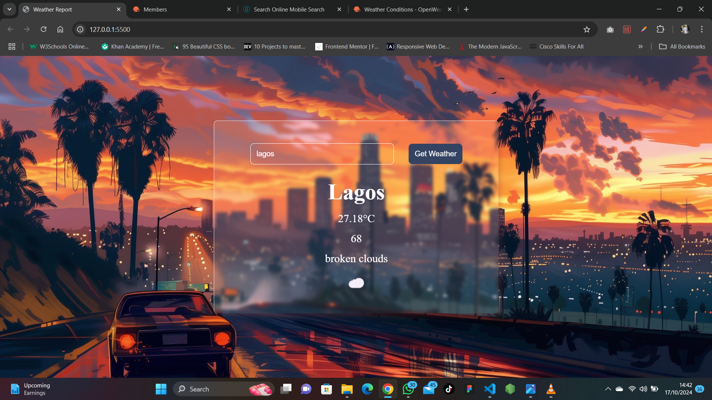

# Weather App

A simple weather application that allows users to search for current weather information for any city worldwide. This app fetches data from an external weather API and displays real-time weather updates including temperature, weather conditions, and other relevant information.

## Features

- **Search Functionality**: Users can input any city name to get the current weather data.
- **Real-Time Weather Data**: Displays accurate temperature, weather conditions (e.g., sunny, rainy, cloudy), humidity, and wind speed.
- **Responsive Design**: Adaptable UI that ensures an optimal viewing experience across different devices (mobile, tablet, desktop).
- **Error Handling**: Provides user-friendly messages for invalid city searches or network errors.

## Installation

1. Clone this repository:

```bash
git clone https://github.com/zarmani34/weather-app.git
```

2. Navigate to the project directory:

```bash
cd weather-app
```

3. Open `index.html` in your preferred browser.

## Usage

1. Enter a city name in the search bar
2. Press enter or click the search button
3. View the current weather information for the specified city

## Tech Stack

- **HTML5**: For structuring the content
- **CSS3**: For styling and creating a responsive layout
- **JavaScript (ES6)**: For dynamic content updates and API integration
- **Weather API**: Data sourced from a third-party weather API

## Screenshots



## Future Enhancements

- **Extended Forecast**: Add a feature to display a 5-day weather forecast
- **Geolocation Integration**: Automatically display the weather for the user's current location
- **Dark Mode**: Implement a toggle for dark/light themes

## Contributing

1. Fork the repository
2. Create your feature branch (`git checkout -b feature/AmazingFeature`)
3. Commit your changes (`git commit -m 'Add some AmazingFeature'`)
4. Push to the branch (`git push origin feature/AmazingFeature`)
5. Open a Pull Request

## License

This project is licensed under the MIT License - see the [LICENSE.md](LICENSE.md) file for details.

## Demo

You can view the live demo of the application here: [Weather App Demo](https://zarmani34.github.io/weather-app/)

## Contact

For any inquiries or feedback, feel free to reach out:

- GitHub: [zarmani34](https://github.com/zarmani34)
- Email: idowuabdulazeez39@gmail.com

## Acknowledgments

- Weather data provided by [https://openweathermap.org/]
